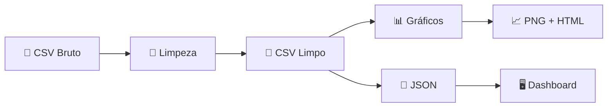

# ⚡ Energy Economics Dashboard

<p align="center">
  
  
  
  
  
  
</p>

Dashboard interativo para análise de indicadores energéticos, ambientais e econômicos de **129 países** no período de **1995 a 2020**. O projeto inclui pipeline completo de tratamento de dados, geração de gráficos estáticos e interativos, e um dashboard web com filtros dinâmicos.

---

## 📋 Índice

- [Visão Geral](#-visão-geral)
- [Funcionalidades](#-funcionalidades)
- [Estrutura do Projeto](#-estrutura-do-projeto)
- [Tecnologias](#-tecnologias)
- [Como Executar](#-como-executar)
- [Pipeline de Dados](#-pipeline-de-dados)
- [Gráficos Gerados](#-gráficos-gerados)
- [Dashboard Interativo](#-dashboard-interativo)
- [Dataset](#-dataset)

---

## 🔍 Visão Geral

Este projeto realiza a análise exploratória de dados sobre economia de energia global, abrangendo:

- **Emissões de CO2** e gases de efeito estufa per capita
- **Consumo de energia renovável** como percentual do consumo final
- **PIB real** (USD constante de 2015)
- **Pegada ecológica**, área florestal, população urbana
- **Índices de capacidade adaptativa** e prontidão climática
- Indicadores climáticos (temperatura média, precipitação)

---

## ✨ Funcionalidades

### Pipeline de Dados (`limpeza_dados.py`)
- Remoção de duplicatas (exatas e por chave país + ano)
- Conversão e validação de tipos de dados
- Tratamento de valores inválidos (percentuais fora de range, valores negativos)
- Preenchimento inteligente de nulos (interpolação por país + mediana global)
- Ordenação e exportação do dataset limpo

### Gráficos Estáticos e Interativos (`graficos.py`)
- 4 gráficos estáticos com **Seaborn/Matplotlib** (PNG)
- 4 gráficos interativos com **Plotly** (HTML)

### Dashboard Web (`dashboard.html`)
- Interface moderna com design dark mode
- Filtros dinâmicos (países, período, métricas, faixa de CO2)
- KPIs em tempo real
- 5 gráficos interativos com **Plotly.js**
- Tabela de dados filtrados com ordenação
- Layout responsivo

---

## 📁 Estrutura do Projeto

```
Atividade-5/
│
├── energy_economics_curated.csv    # Dataset original (bruto)
├── limpeza_dados.py                # Script de limpeza e tratamento
├── energy_economics_limpo.csv      # Dataset tratado (gerado)
│
├── graficos.py                     # Geração de gráficos (Seaborn + Plotly)
├── graficos/                       # Pasta com gráficos gerados
│   ├── 01_evolucao_energia_renovavel.png
│   ├── 02_heatmap_correlacao.png
│   ├── 03_top15_co2_2020.png
│   ├── 04_distribuicao_renovavel_periodo.png
│   ├── 05_mapa_co2_2020.html
│   ├── 06_scatter_pib_co2_animado.html
│   ├── 07_comparativo_paises.html
│   └── 08_treemap_emissoes_2020.html
│
├── gerar_dashboard.py              # Converte CSV limpo para JSON
├── dados_dashboard.json            # Dados em JSON (consumido pelo dashboard)
├── dashboard.html                  # Dashboard interativo (abrir no navegador)
│
└── README.md
```

---

## 🛠 Tecnologias

| Tecnologia | Uso |
|---|---|
| **Python 3** | Pipeline de dados e geração de gráficos |
| **Pandas** | Manipulação e limpeza de dados |
| **NumPy** | Operações numéricas e validação |
| **Matplotlib** | Backend para gráficos estáticos |
| **Seaborn** | Gráficos estatísticos (heatmap, violin, barras) |
| **Plotly** | Gráficos interativos (mapa, scatter, treemap) |
| **HTML/CSS/JS** | Dashboard web interativo |
| **Plotly.js** | Renderização de gráficos no dashboard |

---

## 🚀 Como Executar

### Pré-requisitos

```bash
pip install pandas numpy matplotlib seaborn plotly
```

### 1. Limpeza dos Dados

```bash
python limpeza_dados.py
```

> Gera o arquivo `energy_economics_limpo.csv` a partir do dataset bruto.

### 2. Geração de Gráficos

```bash
python graficos.py
```

> Gera 8 gráficos na pasta `graficos/` (4 PNG + 4 HTML interativos).

### 3. Preparação do Dashboard

```bash
python gerar_dashboard.py
```

> Converte o CSV limpo para `dados_dashboard.json`.

### 4. Abrir o Dashboard

Abra o arquivo `dashboard.html` em um navegador web. 

> **Nota:** É necessário servir os arquivos via um servidor HTTP local para que o carregamento do JSON funcione corretamente:
>
> ```bash
> python -m http.server 8000
> ```
> Depois acesse: [http://localhost:8000/dashboard.html](http://localhost:8000/dashboard.html)

---

## 🔄 Pipeline de Dados



O script `limpeza_dados.py` realiza as seguintes etapas:

1. **Conversão de tipos** — Colunas com valores numéricos em formato string são convertidas
2. **Remoção de duplicatas** — Linhas exatas e duplicatas por (país, ano)
3. **Validação de ranges** — Percentuais [0, 100], índices [0, 1], valores não-negativos
4. **Preenchimento de nulos** — Interpolação linear por país + mediana global como fallback
5. **Ajuste final** — Remoção de espaços, tipagem correta, ordenação

---

## 📊 Gráficos Gerados

### Seaborn (Imagens PNG)

| # | Gráfico | Tipo |
|---|---------|------|
| 1 | Evolução do Consumo de Energia Renovável (Média Global) | Linha temporal com preenchimento |
| 2 | Matriz de Correlação entre Variáveis | Heatmap triangular |
| 3 | Top 15 Países — Emissões de CO2 per Capita (2020) | Barras horizontais |
| 4 | Distribuição do Consumo de Energia Renovável por Período | Violin plot |

### Plotly (HTML Interativos)

| # | Gráfico | Tipo |
|---|---------|------|
| 5 | Emissões de CO2 per Capita por País (2020) | Mapa coroplético mundial |
| 6 | Relação PIB vs Emissões de CO2 (animação por ano) | Scatter animado |
| 7 | Comparativo de Indicadores — 10 Países Selecionados | Painel de linhas (4 subplots) |
| 8 | Top 30 Países — Emissões Totais de GEE (2020) | Treemap |

---

## 🖥 Dashboard Interativo

O dashboard web oferece uma experiência completa de análise com:

### Filtros Disponíveis
- 🌍 **Seleção de países** — Busca e seleção múltipla com tags
- 📅 **Período** — Slider de range para anos (1995–2020)
- 📊 **Métrica principal** — 8 indicadores selecionáveis (CO2, energia renovável, PIB, etc.)
- 🏭 **Faixa de CO2** — Filtro por emissões de CO2 per capita

### Visualizações
- **4 KPI Cards** — Países selecionados, média de energia renovável, média CO2, registros
- **Evolução temporal** — Série da métrica ao longo dos anos
- **Ranking de países** — Top 15 no último ano do período
- **Scatter CO2 vs Renovável** — Correlação com tamanho por população
- **Box plot** — Distribuição anual da métrica selecionada
- **Composição energética** — Donut chart: renovável vs não-renovável
- **Tabela de dados** — Todos os registros filtrados com ordenação

---

## 📦 Dataset

O dataset `energy_economics_curated.csv` contém **3.354 registros** de **129 países** com **18 variáveis**:

| Variável | Descrição |
|----------|-----------|
| `country_name` | Nome do país |
| `country_identifier` | ID numérico do país |
| `observation_year` | Ano de observação (1995–2020) |
| `adaptive_capacity_index` | Índice de capacidade adaptativa [0–1] |
| `foreign_direct_investment_net_inflows_pct_gdp` | Investimento estrangeiro direto (% do PIB) |
| `forest_area_pct_land_area` | Área florestal (% da área terrestre) |
| `real_gdp_constant_2015_usd` | PIB real (USD constante 2015) |
| `renewable_energy_consumption_pct_final_energy_use` | Consumo de energia renovável (% do uso final) |
| `natural_capital_dependency_index` | Índice de dependência de capital natural |
| `urban_population_pct_total_population` | População urbana (% da população total) |
| `readiness_index` | Índice de prontidão |
| `official_development_assistance_usd` | Assistência oficial ao desenvolvimento (USD) |
| `ecological_footprint_index` | Índice de pegada ecológica |
| `co2_emissions_metric_tonnes_per_capita` | Emissões de CO2 per capita (toneladas métricas) |
| `total_greenhouse_gas_emissions_kt_co2e` | Emissões totais de GEE (kt CO2 equivalente) |
| `average_temperature_celsius` | Temperatura média (°C) |
| `annual_precipitation_mm` | Precipitação anual (mm) |
| `total_population` | População total |
| `greenhouse_gas_emissions_metric_tonnes_per_capita` | Emissões de GEE per capita (toneladas métricas) |

---

## 📄 Licença

Este projeto foi desenvolvido como atividade acadêmica.

---

<p align="center">
  Feito com ⚡ por <strong>Atividade 5</strong>
</p>
